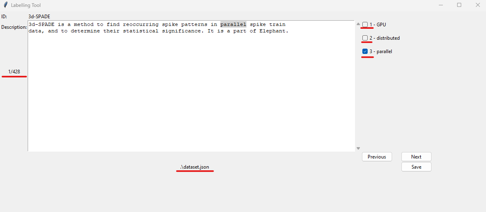

# Toolfinder
A git-like command line tool allowing to:
* Pull data from https://edamontology.org and store it in a database
* Pull data from https://bio.tools and store it in a database
* Create Datasets from the database
* Label Datasets using a simple GUI
* Split Datasets into training and test sets
* Create Dictionaries from Datasets
* Label tools in the database with one of three algorithms


## Setup
Toolfinder relies on [NLTK](https://www.nltk.org/) and [spaCy](https://spacy.io/).
To install NLTK, run:
```shell
pip install nltk
```

To install spaCy, run: 
```shell
pip install -U spacy
python -m spacy download en_core_web_sm
```

## Configuration
An example configuration is stored in `toolfinder.template.ini`. Rename it to `toolfinder.ini` and adapt the values to your needs.

It contains the following values:
* `db.path` - the path to the database file in use
* `multithreading.max_parallel_requests` - the number of parallel threads to use to retrieve biotools
* `nltk.path` - the path to store/search nltk data

## Invoking the tool
To start the program, run 
```shell
python toolfinder.py command subcommand --options
```

## Available Commands
Available commands can be listed using
```shell
python toolfinder.py --help
```
You can invoke the `--help` option on any command or sub command to learn more about the parameters.

### config
The config command can be used to change any configuration value from the `.ini` file. 
It requires two arguments `key` and `value`.
The `key` has to follow the format `section.variable`. 
For example, to set the number of maximum parallel requests to 100, run
```shell
python toolfinder.py config multithreading.max_parallel_requests 100
```

### db-init
This command initializes the database.
Without any parameters provided, it will attempt to create all the tabels. If they already exist, they won't be touched.
If you require the database to be empty, use `--reset`.
This will drop all tables from the database and recreate them. 
If `--reset` is set, before resetting the database the user will be prompted to confirm 
that he indeed wants to reset the database. To disable that, use `--no-confirm`.

Command to completely erase and recreate the database: 
```shell
python toolfinder.py db-init --reset --no-confirm
```

### load
The load command retrieves data from the EDAM ontology and from BioTools. 
The command
```shell
python toolfinder.py load --all
```
pulls both repositories. 
If you want to pull only one of them, you can use 
```shell
python toolfinder.py load {repo}
```
where `{repo}` is replaced with either `EDAM`, or `biotools`.

### search
The search command allows to filter the database for tools with certain criteria.
Without any parameters, the command will return all tool_ids.
```shell
python toolfinder.py search
```

#### Filter by operation
The parameter `--operation` can be used to specify operations that tools in the result should perform. 
It is repeatable and supports searching for operations, their children or all their descendants. 

The command 
```shell
python toolfinder.py search --operation operation_0004 --operation "child(operation_2945)" --operation "sub(operation_2928)"
```
would retrieve all tools that have `operation_0004` assigned OR a direct child of `operation_2945` assigned OR any descendant of `operation_2928` assigned. 

Instead of providing EDAM IDs, you can also provide the name of the EDAM concept:
```shell
python toolfinder.py search --operation Operation --operation "child(Analysis)" --operation "(sub(Alignment))"
```
yields the same result as above.

Please be aware that `child(operation)` and `sub(operation)` do not contain `operation` itself. To add it to the list, simply add the `--operation operation` as well.

#### Filter by keyword in description
The parameter `--keyword` can be used to specify a keyword the description of a tool must contain to appear in the search result.
It is repeatable. 

```shell
python toolfinder.py search --keyword 'parallel' --keyword 'distributed'
```
returns all tools, that have the word `parallel` OR the word `distributed` in their description.

#### Filter by inputs
The parameter `--input` allows to narrow the search result by documented inputs. 
It is repeatable. Multiple entries are connected by OR. So one match is enough to let the tool appear in the search result.

You can search by data type, data format or both, using EDAM id or Name of the EDAM concept

```shell
python toolfinder.py search --input 'Alignment:FASTA` --input 'data_0844' --input "pure rna"
```
returns all tools that have a documented input with data type `Alignment (data_1916)` in the format `FASTA (format_1929)`, OR with the data type `Molecular mass (data_0844)` and any format, OR with the data format `pure rna (format_1217)` for any data type.

#### Filter by outputs
Same as the inputs, but the parameter is `--output`.

#### Filter by label
The parameter `--label` allows to filter the search result by assigned label. 
It is repeatable.

```shell
python toolfinder.py search --label 'parallel' --label 'distributed'
```
returns all tools that have the label `parallel` OR the label `distributed`.

#### Save to file
If the parameter `--out-file` is set and contains a valid file path, the result of the search is written to that file. 
Otherwise the result is printed to stdout. 

### find
The find command allows to find predecessors, successors or replacements for a given tool
This command only works for tools that have inputs, outputs and operation assigned. Only about 10% of all tools have that.
Don't expect a lot of results.

#### predecessor
```shell
python toolfinder.py find predecessor tool_name --operation "sub(operation_2945)" --label 'parallel' --label 'distributed'
```
Returns a list of tools that:
* produce at least one output that the tool `tool_name` has documented as input
* AND that perform any descendant of `operation_2945`
* AND that have the label `parallel` or the label `distributed`

The parameters `--operation` and `--label` are optional.

#### successor
```shell
python toolfinder.py find successor tool_name --operation "sub(operation_2945)" --label 'parallel' --label 'distributed'
```
Returns a list of tools that:
* accept at least one input that the tool `tool_name` has documented as output
* AND that perform any descendant of `operation_2945`
* AND that have the label `parallel` or the label `distributed`

The parameters `--operation` and `--label` are optional.

#### replacement
```shell
python toolfinder.py find replacement tool_name --label 'parallel' --label 'distributed'
```
Returns a list of tools that:
* produce at least one output that the tool `tool_name` has documented as input
* AND that perform any operation that the tool `tool_name` performs
* AND that have the label `parallel` or the label `distributed`

The parameter `--label` is optional.

## dataset
The dataset subcommands allows creating, manually labeling and splitting a dataset. 

### create
```shell
python toolfinder.py dataset create --operation "sub(operation_0004)" --operation operation_0004 --keyword 'parallel' --keyword 'distributed' --keyword 'GPU' --out-file dataset.json 
```
Creates a file named `dataset.json` containing all tools, that
* perform any operation that is either `operation_0004` or any of its descendants
* have one of the keywords `parallel`, `distributed`, `GPU` in their description. 

The file has a structure like this:
```json
{
    "tool_id": {
        "Name": "tool_name",
        "Description": "The description of the tool",
        "parallel" : true, # if the description contains the word parallel, false otherwise
        "distributed": true, # if the description contains the word distributed, false otherwise
        "GPU": true # if the description contains the word GPU, false otherwise
    }
}
```

Just like in the search command, the dataset can be narrowed by inputs, outputs and labels. 
All parameters, except `--out-file` and `--keyword` are optional.

### label
The command 
```shell
python toolfinder.py dataset label dataset.json
```
opens a simple GUI to label the tools. 

Please be aware that the file is overwritten on save! 
#### The GUI and controls
The GUI is automatically populated properties to label from the dataset. In the example above, we created a dataset from the keywords `parallel`, `distributed` and `GPU`.
For this example, the GUI will look like this:


To the right of the ID and Description, the properties are listed with numbers before them. 
These numbers can go up to ten and determine which key you can press to toggle the checkbox. For the numbers `1-9` it is the number keys `1-9`. If the number is `10`, you can toggle it with the `0` key.

You can move through the definitions either by using the `Previous` and `Next` Buttons, or by using the left and right arrow keys on your keyboard.

Should a description be longer than the textbox allows to show, you can scroll up or down using the up and down arrow keys on your keyboard.

You can save by clicking the `Save` Button, or by hitting `CTRL+S` on your Keyboard.

The keywords that were used to create the dataset are highlighted in the description.

When you save the dataset before being done, the last index is stored. If you close and reopen the tool, you will start where you left off.


### split
After labeling a dataset, you may want to split it into training and test set. That is what the split command does.

```shell
python toolfinder.py dataset split --property 'parallel' --proportion 0.75 --file dataset.json --out-dir datasets/
```
Splits the labeled dataset `dataset.json` into test and training sets, such that:
* 75% of the tools that have the property `parallel` set to true and 75% that have the property set to false are in the training dataset
* the rest of the tools are in the test data set

The training and test sets are then stored in the directory provided in `--out-dir`.
The created files have names after the following scheme: `YYYY-mm-ddTHH-MM-ss_{property}_{test|training}_set.json`
In our example, this results in `2024-06-17T12-00-00_parallel_training_set.json` and `2024-06-17T12-00-00_parallel_test_set.json`.

## dictionary
The dictionary command handles the creation of dictionaries for properties.

```shell
python toolfinder.py dictionary create --keyword 'para' --property 'parallel' --file datasets/2024-06-17T12-00-00_parallel_training_set.json --out-file parallel_dict.json
```

Creates a file with the following structure:
```json
{
    "keyword 1": [
        "associated word 1",
        "associated word 2",
        "associated word 3",
        .
        .
        .
    ],
    "keyword 2": [...]
}
```

The `--property` determines which descriptions are considered for dictionary creation. Only descriptions of tools that are labeled as true for this property are taken into account.

The keywords are all words that contain the `--keyword` parameter.
The associated words are all words that are nouns or proper nouns that have a relationship with the keyword in the description.

It is recommended to manually filter the dictionary. It will contain some useless words, that are not actually relevant to the use case. 

## label
This subcommand allows to label tools in the database

### assign
```shell
python toolfinder.py label assign --tool tool --label label
```
assigns the label `label` to the tool `tool`. The tool can be mentioned by name or Biotools id.

### remove-all
The command 
```shell
python toolfinder.py label remove-all --no-confirm
```
removes all labels from the database without asking for confirmation. Omit `--no-confirm` to be prompted for confirmation before deleting all labels.

### all
This command is used to label all tools in the database. 
It supports 3 labelling algorithms: 
* KeywordSearch (`--kws, --KeywordSearch`), sets a label for the tool, if a keyword from a dictionary is present in the description
* WordDistance (`--wd, --WordDistance`), sets a label for a tool, if a match of keyword + associated word in a dictionary can be found with at most `n` words between them
* DependencyParsing (`--dp, --DependencyParsing`), sets a label for the tool, if the description contains a keyword from a dictionary and a word from their associated words with a relationship to the keyword. 

```shell
python toolfinder.py label all --kws --dictionary ./GPU_dict.json --label GPU
```
labels all tools in the database using the `GPU_dict.json` as dictionary with the label `GPU`.

```shell
python toolfinder.py label all --wd --dictionary ./parallel_dict.json --label 'parallel' --max_distance 10
```
labels all tools in the database using the `parallel_dict.json` with the label `parallel` if their descriptions contain a keyword and an associated words with at most 10 words in between them. 

```shell
python toolfinder.py label all --db --dictionary ./distributed_dict.json --label distributed
```
labels all tools in the database using the `distributed_dict.json` with the label `distributed` if their descriptions contain a keyword and an associated word with the two words having a relationship with eachother.